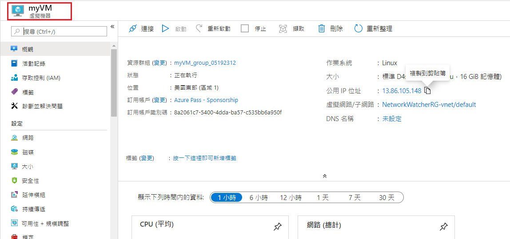
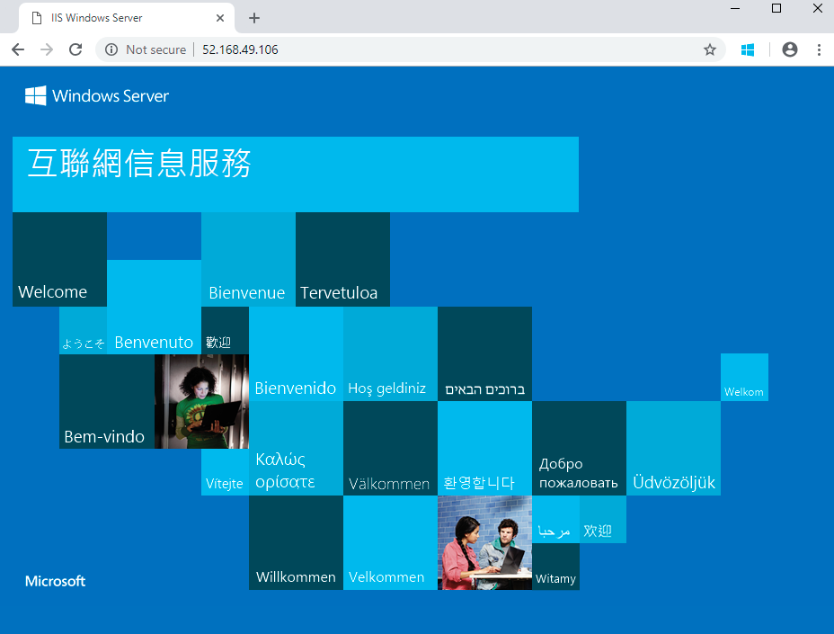

---
wts:
  title: 01 – 在入口網站中建立虛擬機器 (10 分鐘)
  module: Module 02 - Core Azure Services (Workloads)
ms.openlocfilehash: 010d6a19a66f6ac92627720379a4eb850b2ee423
ms.sourcegitcommit: 4a0bfef63f98844f16e2a364d156e96382b8fac5
ms.translationtype: HT
ms.contentlocale: zh-TW
ms.lasthandoff: 05/04/2022
ms.locfileid: "144556867"
---
# <a name="01---create-a-virtual-machine-in-the-portal-10-min"></a>01 – 在入口網站中建立虛擬機器 (10 分鐘)

在這個逐步解說中，我們將在 Azure 入口網站中建立虛擬機器，連線到虛擬機器，安裝 Web 伺服器角色，然後進行測試。 

**注意**：在這個逐步解說中請按一下 [資訊] 圖示，並花點時間閱讀顯示的內容。 

# <a name="task-1-create-the-virtual-machine"></a>工作 1：建立虛擬機器 
1. 登入 Azure 入口網站： **https://portal.azure.com**

3. 從入口網站功能表的 [所有服務] 刀鋒視窗，搜尋並選取 [虛擬機器]，然後按一下 [+建立]，再從下拉式功能表中選擇 [+Azure 虛擬機器]。

4. 在 [**基本**] 索引標籤中，填充下列資訊 (其他內容保留預設值)：

    | 設定 | 值 |
    |  -- | -- |
    | 訂用帳戶 | **使用提供的預設值** |
    | 資源群組 | **建立新的資源群組** |
    | 虛擬機器名稱 | **myVM** |
    | 區域 | **(美國) 美國東部**|
    | 可用性選項 | 無需基礎結構備援選項|
    | 映像 | **Windows Server 2019 Datacenter - Gen 2**|
    | 大小 | **標準 D2s v3**|
    | 管理員帳戶使用者名稱 | **azureuser** |
    | 管理員帳戶密碼 (請仔細輸入！) | **Pa$$w0rd1234**|
    | 輸入連接埠規則 - | **允許選擇連接埠**|
    | 選取輸入連接埠 | **RDP (3389)** 和 **HTTP (80)**| 

5. 切換到 [網路] 索引標籤，確保 **HTTP (80) 和 RDP (3389)** 在區段 [**選取输入連接埠**] 中處於選中狀態。

6. 切換到 [管理] 索引標籤，並在其 [**監視**] 區段中選取以下設定：

    | 設定 | 值 |
    | -- | -- |
    | 開機診斷 | 「停用」|

7. 保留其餘的預設值，然後按一下頁面底部的 [**檢閱 + 建立**] 按鈕。

8. 驗證通過後，按一下 [**建立**] 按鈕。 從任意位置部署虛擬機器可能需要 5 到 7 分鐘的時間。

9. 您將在部署頁面並透過 [**通知**] 區域 (頂部功能表列中的鈴圖示) 接收更新。

# <a name="task-2-connect-to-the-virtual-machine"></a>工作 2：連線到虛擬機器

在這個工作中，我們將使用 RDP (遠端桌面協定) 連線到新的虛擬機器。 

1. 按一下上方藍色工具列上的鈴圖示，並在部署成功後選取 [前往資源]。 

    **注意**：您還可以使用部署頁面上的 [**前往資源**] 連結 

2. 在虛擬機器的 [**概觀**] 刀鋒視窗上，按一下 [**連線**] 按鈕，然後從下拉式功能表中選擇 [**RDP**]。

    ![[連線] 按鈕醒目提示的虛擬機器屬性的螢幕擷取畫面。](../images/0101.png)

    **注意**：下列說明告訴您如何從 Windows 電腦連線到 VM。 在 Mac 電腦上，您需要一個 RDP 用戶端，比如 Mac 應用程式商店的遠端桌面用戶端；而在 Linux 電腦上，您可以使用開放原始碼 RDP 用戶端。

2. 在 [**連線到虛擬機器**] 頁面中，保留預設選項以透過連接埠 3389 連線公用 IP 位址，然後按一下 [**下載 RDP 檔案**]。 將在荧幕左下角下載一個檔案。

3. **開啟** 下載的 RDP 檔案 (位於您的實驗室機器的左下角)，並在出現提示時按一下 [**連線**]。 

    ![[連線] 按鈕醒目提示的虛擬機器屬性的螢幕擷取畫面。 ](../images/0102.png)

4. 在 [**Windows 安全性**] 視窗中，使用建立 VM 時使用的管理員憑據登入：**azureuser** 和密碼 **Pa$$w0rd1234**。 

5. 您可能在登入過程中收到警告證書。 按一下 [**是**] 或建立連線並連線到部署的 VM。 您應該連線成功。

    ![證書警告對話方塊的螢幕擷取畫面，通知用戶不受信任的證書，並醒目提示 [是] 按鈕。 ](../images/0104.png)

一個新的虛擬機器 (myVM) 將在您的實驗室內啟動。 關閉彈出的伺服器管理員和儀錶板視窗 (按一下右上角的 x)。 您應該看到虛擬機器的藍色背景。 **恭喜！** 您已部署並連線到執行 Windows Server 的虛擬機器。 

# <a name="task-3-install-the-web-server-role-and-test"></a>工作 3：安裝 Web 伺服器角色並進行測試

在這個工作中，將在您剛剛建立的虛擬機器的伺服器上安裝 Web 伺服器角色，並確保將顯示預設 IIS 歡迎頁面。 

1. 在新開啟的虛擬機器中，透過在搜尋列中搜尋 **PowerShell** 來啟動 PowerShell，找到後以滑鼠右鍵按一下 **Windows PowerShell** **以系統管理員身分執行**。

    ![虛擬機器桌面的螢幕擷取畫面，其中按一下 [開啟] 按鈕並選取 PowerShell 然後醒目提示 [以系統管理員身分執行]。](../images/0105.png)

2. 在 PowerShell 中，透过執行下列命令，在虛擬機器中安裝 **Web 伺服器** 功能。 (在命令中貼上並按 ENTER 開始安裝)。

    ```PowerShell
    Install-WindowsFeature -name Web-Server -IncludeManagementTools
    ```
  
3. 完成後，將出現一個提示，說明 [**成功**] 的值為 **True**。 您無需重新啟動虛擬機器即可完成安裝。 按一下虛擬機器頂部中間藍色條上的 **x** ，關閉與 VM 的 RDP 連線。 您還可以透過按一下頂部中間藍色條上的 **-** 來最小化它。

    

4. 回到入口網站，導覽回 myVM 的 **[概觀]** 刀鋒視窗，然後使用 [**按一下到剪貼板**] 按鈕複製 myVM 的公用 IP 位址，開啟新的瀏覽器索引標籤，將公用 IP 位址貼到 URL 文字方塊中，然後按 **Enter** 鍵瀏覽它。

    

5. 將顯示預設 IIS Web 伺服器歡迎頁面。

    

**恭喜！** 您已經建立了一個可透過其公用 IP 位址存取的執行 Web 伺服器的新 VM。 如果要託管一個 Web 應用程式，則可以將應用程式檔案部署到虛擬機器，並將其託管在已部署的虛擬機器上以供公眾存取。


**注意**：為了避免額外的成本，您可以選擇删除此資源群組。 搜尋資源群組，按一下您的資源群組，然後按一下 [**删除資源群組**]。 驗證資源群組的名稱，然後按一下 [**删除**]。 監視 [**通知**] 以驗證删除是否成功完成。 
