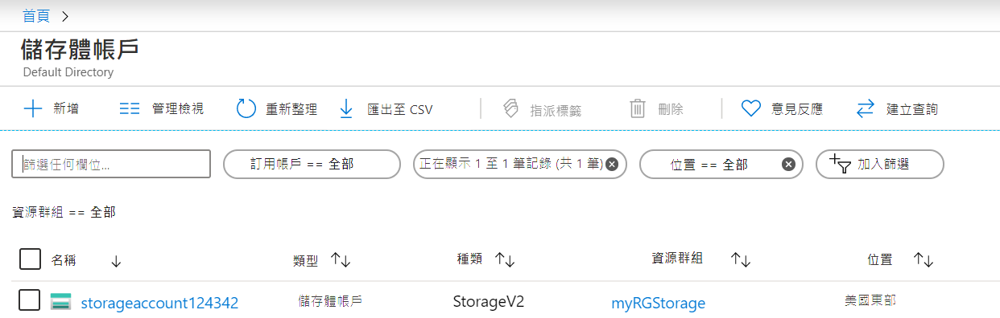

---
wts:
  title: 05 - 建立 Blob 儲存體 (5 分鐘)
  module: Module 02 - Core Azure Services (Workloads)
ms.openlocfilehash: 554a3eb1c95b354e836fe22541f00fa1eb0bc2de
ms.sourcegitcommit: 26c283fffdd08057fdce65fa29de218fff21c7d0
ms.translationtype: HT
ms.contentlocale: zh-TW
ms.lasthandoff: 01/27/2022
ms.locfileid: "137907634"
---
# 05 - 建立 Blob 儲存體 (5 分鐘)

在這個逐步解說中，我們將建立一個儲存體帳戶，然後使用 Blob 儲存體檔案。

# 工作 1：建立儲存體帳戶 

在這個工作中，我們將建立新的儲存體帳戶。 

1. 在 <a href="https://portal.azure.com" target="_blank">https://portal.azure.com</a> 登入 Azure 入口網站

2. 從 [**所有服務**] 刀鋒視窗，搜尋並選取 [**儲存體帳戶**]，然後按一下 [ **+ 新增、+ 建立、+ 新建**]。 

3. 在 [**建立儲存體帳戶**] 刀鋒視窗的 [**基本**] 索引標籤上，填充下列資訊 (將儲存體帳戶名稱中的 **xxxx** 替換為字母和數位，以便名稱全域唯一)。 其他內容都保留預設值。

    | 設定 | 值 | 
    | --- | --- |
    | 訂用帳戶 | **保留提供的預設值** |
    | 資源群組 | **建立新的資源群組** |
    | 儲存體帳戶名稱 | **storageaccountxxxxx** |
    | Location | **(美國) 美國東部**  |
    | 效能 | **Standard** |
    | 備援性 | **本機備援儲存體 (LRS)** |
    
    **注意** - 記得變更 **xxxxx**，將其設定為唯一 **儲存體帳戶名稱**

5. 按一下 [**檢閱 + 建立**]，檢閱儲存體帳戶設定並允許 Azure 驗證設定。 

6. 驗證完成後，請按一下 [**建立**]。 等待帳戶已成功建立的通知。 

7. 從主頁中，搜尋並選取[**儲存體帳戶**]，並確保列出了新的儲存體帳戶。

    

# 工作 2：使用 Blob 儲存體

在這個工作中，我們將建立一個 Blob 容器並上傳一個 Blob 檔案。 

1. 按一下新儲存體帳戶的名稱，在左側功能表中滾動到 [**資料儲存體**] 區段，然後按一下 [**容器**]。

2. 按一下 **[+ 容器]** ，並完成資訊。 使用 [資訊] 圖示瞭解詳細資訊。 完成後，按一下 [建立]。

    | 設定 | 值 |
    | --- | --- |
    | 名稱 | **container1**  |
    | 公用存取層級| **私人 (沒有匿名存取)** |
  

    

4. 打開一個新的瀏覽器視窗，並在 **Bing** 中搜尋花的影像。 以滑鼠右鍵按一下影像並將其儲存到虛擬機器。 

6. 返回到入口網站，按一下 **container1**，然後選取 [**上傳**]。

5. 瀏覽尋找您剛剛儲存在本地電腦上的影像檔案。 將其選中，接著選取 [上傳]。

   
6. 按一下 [**進階**] 箭頭，保留預設值，但是檢閱可用選項，接著按一下 [**上傳**]。

    **注意**：您可以用這種方式上傳任意多的 Blob。 新的 Blob 將在容器中列出。

7. 上傳檔案後，以滑鼠右鍵按一下該檔案並注意包括檢閱/編輯、下載、屬性和删除在內的選項。 

8. 有時間時，請檢視檔案、表和隊列的選項。

# 工作 3：監視儲存體帳戶

1. 返回到 [儲存體帳戶] 刀鋒視窗並按一下 [**診斷和解决問題**]。 

2. 探索一些最常見的儲存體問題。 請注意，此處有多個疑難排解員。

3. 在儲存體帳戶刀鋒視窗上，向下滾動到 [**監視**] 區段，然後按一下 [**見解**]。 請注意，這裡有關於故障、效能、可用性和容量的資訊。 您的資訊可能所有不同。

    ![儲存體帳戶 [見解] 頁面的螢幕擷取畫面。](../images/0403.PNG)

恭喜！ 您已經建立了一個儲存體帳戶，然後使用了儲存體 Blob。

**注意**：為了避免額外的成本，您可以選擇删除此資源群組。 搜尋資源群組，按一下您的資源群組，然後按一下 [**删除資源群組**]。 驗證資源群組的名稱，然後按一下 [**删除**]。 監視 [**通知**] 以驗證删除的狀態。
