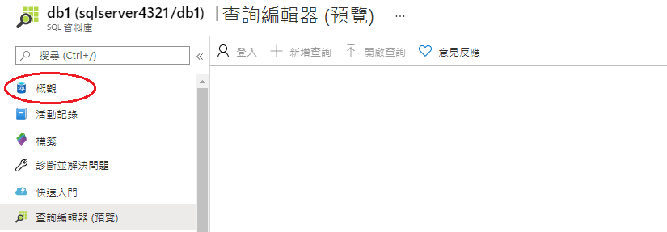
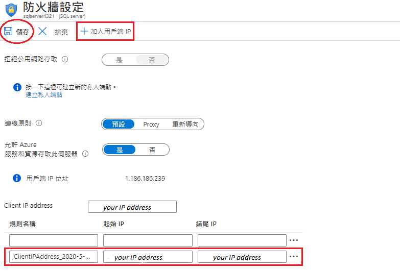

---
wts:
  title: 06 - 建立 SQL Database (5 分鐘)
  module: Module 02 - Core Azure Services (Workloads)
ms.openlocfilehash: 61a0e7c7b54ed7cd13a9eae427a5b41abc51cffe
ms.sourcegitcommit: 26c283fffdd08057fdce65fa29de218fff21c7d0
ms.translationtype: HT
ms.contentlocale: zh-TW
ms.lasthandoff: 01/27/2022
ms.locfileid: "137907651"
---
# <a name="06---create-a-sql-database-5-min"></a>06 - 建立 SQL Database (5 分鐘)

在這個逐步解說中，我們將在 Azure 中建立 SQL Database，然後査詢該資料庫中的資料。

# <a name="task-1-create-the-database"></a>工作 1：建立資料庫 

在此工作中，我們將依據 AdventureWorksLT 範例資料庫來建立 SQL 資料庫。 

1. 在 [ **https://portal.azure.com** ](https://portal.azure.com) 登入 Azure 入口網站。

2. 從 [**所有服務**] 刀鋒視窗，搜尋並選取 [**SQL Database**]，然後按一下 [ **+ 新增、+ 建立、+ 新建**]。 

3. 在 [基本知識] 索引標籤上填入此資訊。  

    | 設定 | 值 | 
    | --- | --- |
    | 訂用帳戶 | **使用提供的預設值** |
    | 資源群組 | **建立新的資源群組** |
    | 資料庫名稱| **DB1** | 
    | 伺服器 | 選取 [**新增**] (右側將打開一個新的側邊欄)|
    | 伺服器名稱 | **sqlserverxxxx** (必須唯一) | 
    | Location | **(美國) 美國東部** |
    | 驗證方法 | **使用 SQL 驗證** |
    | 伺服器管理員登入 | **sqluser** |
    | 密碼 | **Pa$$w0rd1234** |
    | 按一下  | **確定** |

   ![[伺服器] 窗格與 [新增伺服器] 窗格的螢幕擷取畫面，其中欄位依資料表填入，並醒目提示 [檢閱 + 建立] 與 [確定] 按鈕。](../images/0501.png)

4. 在 [**網路**] 索引標籤上，設定下列設定 (保留其他項目為預設值) 

    | 設定 | 值 | 
    | --- | --- |
    | 連線方法 | **公用端點** |    
    | 允許 Azure 服務和資源存取此伺服器 | **是** |
    | 新增目前的用戶端 IP 位址 | **否** |
    
   ![[建立 SQL Database] 刀鋒視窗的 [網路] 索引標籤的螢幕擷取畫面，根據表選擇設定，並醒目提示 [檢閱 + 建立] 按鈕。](../images/0501b.png)

5. 在 [**安全性**] 索引標籤上。 

    | 設定 | 值 | 
    | --- | --- |
    | 適用於 SQL 的 Microsoft Defender| **現在不要** |
    
6. 前往 [**其他設定**] 索引標籤。我們將使用 AdventureWorksLT 範例資料庫。

    | 設定 | 值 | 
    | --- | --- |
    | 使用現有的資料 | **範例** |

    ![[建立 SQL Database] 刀鋒視窗的 [其他設定] 索引標籤的螢幕擷取畫面，根據表選擇設定，並醒目提示 [檢閱 + 建立] 按鈕。](../images/0501c.png)

7. 按一下 [**檢閱 + 建立**]，然後按一下 [**建立**] 以部署和佈建資源群組和資料庫。 大學需要 2 - 5 分鐘才能完成部署。


# <a name="task-2-test-the-database"></a>工作 2：測試資料庫。

在此工作中，我們將設定 SQL 伺服器並執行 SQL 查詢。 

1. 部署完成後，請在 [部署] 刀鋒視窗中按一下 [前往資源]。 也可以從 [**所有資源**] 刀鋒視窗，搜尋並選取 [**資料庫**]，然後選取 [**SQL Database**]，確保您已建立新資料庫。 您可能需要 **重新整理** 頁面。

    

2. 按一下表示您建立的 SQL Database 的 **db1** 項目。 在 [db1] 刀鋒視窗上，按一下 [**査詢編輯器 (預覽)** ]。

3. 使用密碼 **Pa$$w0rd1234**，以 **sqluser** 身分登入。

4. 您將無法登入， 請仔細閱讀錯誤，並記下必須透過防火牆允許的 IP 位址。 

    ![[查詢編輯器] 登入頁面的螢幕擷取畫面，其中包含 IP 位址錯誤。](../images/0503.png)

5. 返回到 [**db1**] 刀鋒視窗中，按一下 [**概觀**]。 

    

6. 在 db1 的 [**概觀**] 刀鋒視窗中，按一下位於概觀荧幕頂部中間的 [**設定伺服器防火牆**]。

7. 按一下 [ **+ 新增用戶端 IP**] (頂部功能表列)，新增錯誤中引用的 IP 位址。 (它可能已經為您自動填充 - 如果沒有，請將其貼上到 IP 位址欄位中)。 請務必 **儲存** 您的變更。 

    

8. 返回到 SQL Database (將底部的切換列滑到左側)，然後按一下 [**査詢編輯器 (預覽)** ]。 嘗試再次使用密碼 **Pa$$w0rd1234**，以 **sqluser** 身分登入。 這次您應該會成功。 請注意，部署新的防火牆規則可能需要幾分鐘的時間。 

9. 成功登入後，將顯示査詢窗格。 在編輯器窗格中輸入以下查詢。 

    ```SQL
    SELECT TOP 20 pc.Name as CategoryName, p.name as ProductName
    FROM SalesLT.ProductCategory pc
    JOIN SalesLT.Product p
    ON pc.productcategoryid = p.productcategoryid;
    ```

    ![查詢編輯器的螢幕擷取畫面，其中包含 [查詢] 窗格與成功執行的命令。](../images/0507.png)

10. 按一下 [執行]，然後在 [結果] 窗格中檢閱查詢結果。 應該能成功執行該查詢。

    ![資料庫 [查詢編輯器] 窗格的螢幕擷取畫面，其中已成功執行 SQL 程式碼，且輸出會顯示在 [結果] 窗格中。](../images/0508.png)

恭喜！ 您已在 Azure 中建立 SQL Database，然後成功査詢了該資料庫中的資料。

**注意**：為了避免額外的成本，您可以選擇删除此資源群組。 搜尋資源群組，按一下您的資源群組，然後按一下 [**删除資源群組**]。 驗證資源群組的名稱，然後按一下 [**删除**]。 監視 [**通知**] 以驗證删除的狀態。
