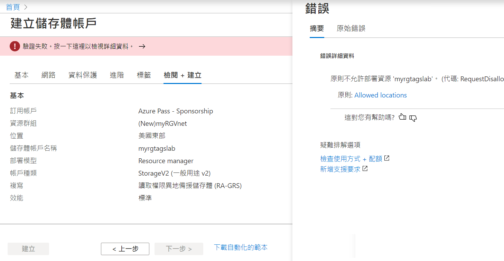
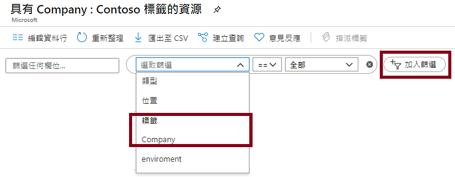

---
wts:
  title: 16 – 實作資源標記 (5 分鐘)
  module: 'Module 05: Describe identity, governance, privacy, and compliance features'
ms.openlocfilehash: cc7a298eb03be3dfcbcc1c69cfa7409bc94c0640
ms.sourcegitcommit: dfe52fea15c568547ba630e9b337ec8df957ad80
ms.translationtype: HT
ms.contentlocale: zh-TW
ms.lasthandoff: 02/25/2022
ms.locfileid: "139213862"
---
# 16 – 實作資源標記 (5 分鐘)

在這個逐步解說中，我們將建立需要標記的原則指派，建立儲存體帳戶並測試標記，檢視具有指定標記的資源，然後删除標記原則。

# 工作 1：建立原則指派 

在這個工作中，我們將 [**需要資源上的標記**] 原則並將其指派給我們的訂用帳戶。 

1. 登入 [Azure 入口網站](https://portal.azure.com)。

2. 從 [**所有服務**] 刀鋒視窗，搜尋並選取 [**原則**]。

3. 向下滾動到 [**製作**] 區段，按一下 [**指派**]，然後按一下頁面頂部的 [**指派原則**]

4. 請注意，我們的原則 [**範圍**] 將是訂用帳戶範圍。 

5. 在 [**基本**] 下，選取 [**原則定義**] 省略號按鈕 (文字方塊的右側)。 在 [**搜尋**] 方塊中，輸入值 **tag**。 包含字詞 **tag** 的相關原則清單將會顯示。 向下捲動直到您找到 **資源必須有標籤及其值** 定義，按一下它再按一下 [選取]。

   
   
6.  在 [參數] 索引標籤上鍵入 **Company :Contoso ** 作為標籤金鑰/值對名稱。 按一下 [**檢閱 + 建立**]，然後按一下 [**建立**]。

  

7. **資源必須有標籤及其值** 原則指派現已到位。 建立資源時，必須包含帶有 Company :Contoso 金鑰的標籤。
   **注意 - 您需要等待最長達 30 分鐘的時間才能套用完原則。** 

  

# 工作 2：建立儲存體帳戶以測試所需的標記

在這個工作中，我們將建立儲存體帳戶以測試所需的標記。 

1. 在 Azure 入口網站的 [**所有服務**] 刀鋒視窗，搜尋並選取 [**儲存體帳戶**]，然後按一下 [ **+ 新增、+ 建立或 +新建**]。

2. 在 [**建立儲存體帳戶**] 刀鋒視窗的 [**基本**] 索引標籤上，填充下列資訊 (將儲存體帳戶名稱中的 **xxxx** 替換為字母和數位，以便名稱全域唯一)。 其他內容都保留預設值。

    | 設定 | 值 | 
    | --- | --- |
    | 訂用帳戶 | **使用提供的預設值** |
    | 資源群組 | **建立新的資源群組** |
    | 儲存體帳戶名稱 | **storageaccountxxxx** |
    | Location | **(美國) 美國東部** |

3. 按一下 [檢閱 + 建立]。 

    **注意：** 我們正在測試，看看當標記沒有提供時會發生什麼。 請注意，原則可能需要長達 30 分鐘才會生效。

4. 您將收到驗證失敗訊息。 按一下 [**按一下此處查看詳細資訊**] 訊息。 在 [**錯誤**] 刀鋒視窗的 [**摘要**] 索引標籤上，請注意說明了原則不允許使用資源的錯誤訊息。

    **注意：** 如果您檢視 [原始錯誤] 索引標籤，您將看到所需的特定標記名稱。 

    

5. 關閉 [**錯誤**] 窗格，並按一下 [**上一步**] (熒幕底部)。 提供標記資訊。 

    | 設定 | 值 | 
    | --- | --- |
    | 標籤名稱 | **Company:Contoso** (可能不在下拉式清單中) |

6. 按一下 [**檢閱 + 建立**]，然後檢查驗證是否成功。 按一下 [**建立**] 以部署儲存體帳戶。 

# 工作 3：檢視使用特定標記的所有資源

1. 在 Azure 入口網站的 [**所有服務**] 刀鋒視窗，搜尋並選取 [**原則**]。

2. 注意所有標記及其值。 按一下 **Company :Contoso** 金鑰/值對。 這將顯示一個刀鋒視窗，顯示新建立的儲存體帳戶，只要您在部署期間包含了標記。 

   

3. 在入口網站中，顯示 [**所有資源**] 刀鋒視窗。

4. 按一下 [**新增篩選器**]，並新增 **Company** 標記金躍作為篩選器類別。 套用篩選器後，將只列出您的儲存體帳戶。

    

# 工作 4：刪除原則指派

在這個工作中，我們將刪除 [**需要資源上的標記**] 原則，這樣它就不會影響我們將來的工作。 

1. 在入口網站的 [**所有服務**] 刀鋒視窗，搜尋並選取 [**原則**]。

2. 按一下 [**需要資源上的標記**] 原則項目。

3. 按一下頂部功能表的 [**刪除指派**]。

4. 透過按一下 [**是**] 確認要在 [**删除指派**] 對話方塊中删除和原則指派

5. 如果有時間，請建立另一個沒有標記的資源，以確保原則不再有效。

恭喜！ 在這個逐步解說中，我們建立了需要標記的原則指派，建立了儲存體帳戶資源並測試了要標記的原則，檢視了具有指定標記的資源，然後删除了標記原則。

**注意**：為了避免額外的成本，您可以選擇删除此資源群組。 搜尋資源群組，按一下您的資源群組，然後按一下 [**删除資源群組**]。 驗證資源群組的名稱，然後按一下 [**删除**]。 監視 [**通知**] 以驗證删除的狀態。
